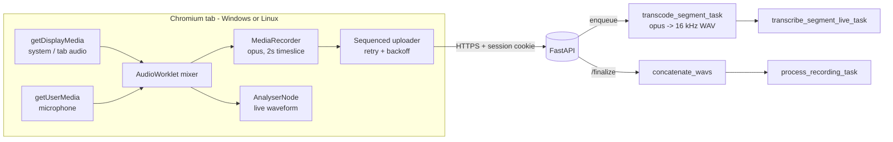

# Audio Capture Refactor: Decommissioning the Companion App

Status: Proposed
Owner: TBA
Target release: next major (`vX.0.0`, breaking)
Last updated: 2026-05-25

## 1. Goal

Eliminate the Tauri-based Windows Companion app entirely and move all live audio
capture into the browser using `getDisplayMedia` (system / tab audio) and
`getUserMedia` (microphone). This removes a persistent class of friction
(install, pairing, TOFU TLS pinning, `nojoin://` handler, Firefox enterprise
roots, tray) and unblocks first-class Linux support without porting Tauri.

This is a **hard cutover**. The `companion/` subtree, all pairing endpoints,
the local-control HTTPS server, and the Companion UI surface are deleted in
the same release.

## 2. Locked Decisions

| # | Decision | Value |
|---|----------|-------|
| D1 | Migration aggression | Hard cutover, no Companion shipped |
| D2 | Supported capture browsers | Chromium-family (Chrome, Edge, Brave, Arc) on Windows and Linux only |
| D3 | macOS native meeting apps | Out of scope; users open the meeting in a Chromium tab |
| D4 | Audio transport | Hybrid: opus/webm during live, canonical 16 kHz mono PCM WAV produced at `/finalize` |
| D5 | Tab close / refresh | Recording moves to `PAUSED`; uploaded segments retained; in-memory tail dropped; resume / cancel modal on return |
| D6 | Pause semantics | Uploaded segments kept, new segments resume at `lastSequence + 1` |
| D7 | Transcode location | Dedicated per-segment Celery task (`transcode_segment_task`) |
| D8 | Legacy Companion endpoints | Return HTTP **410 Gone** with a structured retirement payload |
| D9 | Meet Now on unsupported browsers | Button **disabled** with inline explanation + link to capture docs |
| D10 | Capture Settings scope | Minimal: mic device picker, per-source gain (system vs mic). No in-settings capture preview - users validate by recording a real test meeting. |
| D11 | PAUSED retention | Indefinite. Paused recordings are never auto-cancelled. While a paused recording exists for the user, Meet Now and Import are blocked behind a mandatory resume-or-cancel modal. |
| D12 | Live waveform surface | Continue to render only on the live recording page, exactly as today. No new waveform surface in Capture Settings. |

## 3. Target Architecture



Removed in this release: `nojoin://pair`, `localhost:12345`, companion access
tokens, per-recording upload tokens, TOFU TLS pinning, local HTTPS identity
on the desktop, Companion tray, Companion settings page, Companion auto-update.

## 4. Constraints and Non-Goals

- Firefox, Safari, mobile browsers, and macOS are **explicitly unsupported**
  for capture. They retain full review / playback / admin functionality.
- macOS users who need capture are told to install the web build of their
  meeting tool in Chrome/Edge and use tab-audio sharing.
- No virtual-loopback bundling. No first-party macOS helper. No Companion
  fallback path.
- Existing recordings remain fully usable; nothing about playback, transcript,
  diarisation, or speaker management changes.

## 5. Phase Overview (Waterfall)


Each phase has a hard exit gate. No phase begins until the prior phase's exit
gate is signed off.

---

## Phase A - Backend Foundations: Auth, Status, and Lifecycle

**Exit gate:** A logged-in browser session can call `/recordings/init`,
`/recordings/{id}/segment` (with a WAV payload, mocked), `/recordings/{id}/pause`,
`/recordings/{id}/resume`, and `/recordings/{id}/finalize` using only the
session cookie. No companion tokens are issued or required.

### A.1 Recording status model

- [ ] A.1.1 Add `RecordingStatus.PAUSED` in [backend/models/recording.py](backend/models/recording.py).
- [ ] A.1.2 Add migration `add_paused_recording_status` under
      [backend/alembic/versions/](backend/alembic/versions/). Idempotent enum
      addition; no row backfill needed.
- [ ] A.1.3 Update `_ensure_recording_accepts_*` guards in
      [backend/api/v1/endpoints/recordings.py](backend/api/v1/endpoints/recordings.py)
      to accept both `UPLOADING` and `PAUSED` for segment and status writes,
      and to reject finalize while `PAUSED`.

### A.2 Auth consolidation

- [ ] A.2.1 In [backend/api/deps.py](backend/api/deps.py), change
      `get_current_recording_client_user` to resolve a normal session-cookie
      user first, falling back to the per-recording token only if present.
- [ ] A.2.2 Mark `get_current_companion_bootstrap_user` and
      `COMPANION_RECORDING_SCOPE` as `Deprecated` (kept for one phase, deleted
      in Phase E).
- [ ] A.2.3 Add ownership assertion helper `_assert_recording_owner` reused by
      all new endpoints in A.3.

### A.3 Pause / Resume / Cancel endpoints

- [ ] A.3.1 `POST /v1/recordings/{recording_id}/pause` -> set status to
      `PAUSED`, write `pipeline_metric(stage="recording_paused")`. Returns
      `{recording_id, status, last_sequence}` where `last_sequence` is the max
      sequence currently present on disk under the recording's temp dir.
      Must accept `navigator.sendBeacon` requests (no preflight, small body).
- [ ] A.3.2 `POST /v1/recordings/{recording_id}/resume` -> require status
      `PAUSED`, set back to `UPLOADING`, return same shape so the browser can
      pick the next sequence number.
- [ ] A.3.3 Confirm the existing `POST /v1/recordings/{recording_id}/discard`
      handles both `UPLOADING` and `PAUSED` (Cancel-from-resume-modal path).
- [ ] A.3.4 `GET /v1/recordings?status=paused&user=me` (or extend the existing
      list endpoint) returns the active paused recording(s) for the current
      user so the frontend guard can detect them on app boot.
- [ ] A.3.5 `POST /v1/recordings/init` rejects with HTTP **409** when the
      caller already owns a `PAUSED` or `UPLOADING` recording. Error body
      includes the offending `recording_id` so the frontend can route into
      the resume modal. There is **no auto-cancel sweep** for paused
      recordings; retention is indefinite by design (D11).

### A.4 Tests

- [ ] A.4.1 Pytest: pause -> resume -> additional segment -> finalize round-trip.
- [ ] A.4.2 Pytest: pause -> discard cleans temp dir and marks chunks failed.
- [ ] A.4.3 Pytest: session-cookie auth on segment / finalize works without any
      companion token in the request.

---

## Phase B - Backend: Per-Segment Transcode Pipeline

**Exit gate:** A `webm/opus` payload posted to `/recordings/{id}/segment` is
durably written, transcoded asynchronously to a 16 kHz mono WAV in the same
recording temp dir, and consumed by `transcribe_segment_live_task` exactly as
the WAV path is today. Finalize concatenates the WAV outputs and the canonical
artefact byte-for-byte matches the previous Companion path for an equivalent
input.

### B.1 Segment endpoint accepts opus

- [ ] B.1.1 `upload_segment` in
      [backend/api/v1/endpoints/recordings.py](backend/api/v1/endpoints/recordings.py)
      reads the `Content-Type` and the filename suffix; permitted set:
      `audio/webm`, `audio/ogg`, `audio/wav`. Anything else -> 415.
- [ ] B.1.2 Webm payload is written to `{sequence}.webm` (not `.wav`); WAV
      payload retains current behaviour for the Phase A test harness.
- [ ] B.1.3 Skip the existing `_sync_recording_audio_chunks_from_directory`
      sync for webm segments until B.2 produces their WAV sibling.

### B.2 Transcode worker

- [ ] B.2.1 New module `backend/processing/segment_transcode.py` with
      `transcode_segment_task(recording_id: int, sequence: int)`.
- [ ] B.2.2 Task locates `{sequence}.webm`, invokes `ffmpeg -nostdin -loglevel error -i in.webm -ar 16000 -ac 1 -f wav -y out.wav`,
      writes to `{sequence}.wav`, then deletes the `.webm`.
- [ ] B.2.3 On success, call `_sync_recording_audio_chunks_from_directory` and
      `_sync_recording_audio_window_manifests` (same calls the upload endpoint
      makes today), then dispatch `transcribe_segment_live_task.delay(...)`.
- [ ] B.2.4 On failure: write `{sequence}.transcode_failed`, emit
      `pipeline_metric(stage="segment_transcode_failed")`, do NOT poison
      finalize - missing sequences already 409 there.

### B.3 Endpoint dispatch

- [ ] B.3.1 When the segment is webm, the API endpoint enqueues
      `transcode_segment_task.delay(...)` instead of the live transcribe task
      directly. WAV path keeps current dispatch.
- [ ] B.3.2 Verify queue routing in [backend/celery_app.py](backend/celery_app.py) -
      transcode task lives on the existing default worker queue (no new queue).

### B.4 Image / dependency changes

- [ ] B.4.1 Ensure `ffmpeg` is present in [docker/Dockerfile.worker](docker/Dockerfile.worker).
      It already is via torchaudio's runtime, but add explicit `apt-get install -y ffmpeg`
      to make the dependency explicit.
- [ ] B.4.2 No change to [docker/Dockerfile.api](docker/Dockerfile.api) - API stays lean.

### B.5 Tests

- [ ] B.5.1 Pytest: upload a fixture `2s.webm` -> task runs -> resulting WAV
      is 16 kHz mono and `transcribe_segment_live_task` is dispatched.
- [ ] B.5.2 Pytest: corrupted webm -> `transcode_failed` marker present, no
      live dispatch, finalize 409 on missing sequence.
- [ ] B.5.3 Golden-file test: known input opus -> canonical WAV bytes match
      reference within tolerance (sample-rate and channel layout strict).

---

## Phase C - Frontend Capture Stack (New)

**Exit gate:** Behind a `?capture=browser` query flag, a developer can start a
recording from Meet Now in Chrome on Linux, see live waveform, see live
transcript appear, pause via the in-app pause button, resume, navigate away,
return to the resume modal, finalize, and view the resulting recording end to
end. No reference to Companion code remains in the new module.

### C.1 New module: `frontend/src/lib/capture/`

- [ ] C.1.1 `featureDetect.ts` - returns
      `{supported: boolean, reason?: "firefox" | "safari" | "macos_chromium" | "mobile" | "unknown"}`.
      Uses `navigator.userAgentData` where available, UA string fallback,
      probes for `getDisplayMedia`.
- [ ] C.1.2 `pickSource.ts` - sequential prompts: `getDisplayMedia({video:true, audio:true, systemAudio:"include", selfBrowserSurface:"include"})`,
      then `getUserMedia({audio:{deviceId}})`. If the user grants video but no
      audio track, prompt: "Please tick Share audio in the picker and try again."
- [ ] C.1.3 `mixer.ts` - `AudioContext` graph: two
      `MediaStreamAudioSourceNode` -> two `GainNode` (configurable) ->
      `ChannelMergerNode` (mono downmix) -> `MediaStreamAudioDestinationNode`.
      Expose the destination stream, the analyser tap, and gain setters.
- [ ] C.1.4 `recorder.ts` - wraps `MediaRecorder(stream, {mimeType:"audio/webm;codecs=opus", audioBitsPerSecond:64000})`
      with `recorder.start(2000)`. Each `dataavailable` event becomes a
      sequenced `Blob`. Implements pause / resume mapped to MediaRecorder
      pause / resume.
- [ ] C.1.5 `uploader.ts` - sequence-gated queue with exponential backoff
      (port the logic of `SegmentThreadOutcome` / `SegmentUploadOutcome` in
      [companion/src-tauri/src/audio.rs](companion/src-tauri/src/audio.rs)).
      `POST /v1/recordings/{id}/segment?sequence=N` with `credentials:"include"`,
      `Content-Type: audio/webm`. Max 5 retries per segment; on exhaustion the
      controller surfaces a fatal banner and pauses the recording.
- [ ] C.1.6 `waveform.ts` - `AnalyserNode` + `requestAnimationFrame` polling,
      exposes a React hook `useLiveWaveform(controller)`.
- [ ] C.1.7 `lifecycle.ts` - listens for `visibilitychange`, `pagehide`,
      `beforeunload`, and Next.js router `routeChangeStart`. On any guarded
      exit: stop MediaRecorder, drop the tail Blob, fire-and-forget
      `POST /v1/recordings/{id}/pause` via `navigator.sendBeacon` for tab
      close, persist `{recordingId}` in `sessionStorage`. On boot, if a
      `paused` recording is found for the current user (see D.2.4), render
      the mandatory resume modal.
- [ ] C.1.8 `controller.ts` - the single public surface; orchestrates
      `pickSource`, `mixer`, `recorder`, `uploader`, `waveform`, and
      `lifecycle`. Emits typed events the React layer subscribes to.

### C.2 React integration

- [ ] C.2.1 New `frontend/src/lib/capture/CaptureProvider.tsx` - React context
      that owns the controller singleton.
- [ ] C.2.2 New `useCapture()` hook exposing `start`, `pause`, `resume`,
      `stop`, `cancel`, plus reactive `status`, `levels`, `error`,
      `lastSequence`.

### C.3 Unit tests (Vitest)

- [ ] C.3.1 `uploader.test.ts` - sequence ordering, retry, backoff, fatal exit.
- [ ] C.3.2 `mixer.test.ts` - gain changes propagate; mono downmix correctness
      against a synthetic two-source fixture.
- [ ] C.3.3 `lifecycle.test.ts` - pause is dispatched once on `pagehide`, not
      duplicated on subsequent `visibilitychange` events.
- [ ] C.3.4 `featureDetect.test.ts` - correctly tags each of the unsupported
      branches given fixtured UA strings.

---

## Phase D - Frontend UI Integration

**Exit gate:** `?capture=browser` is removed; the new stack is the only path.
All components that referenced `companionLocalApi` are either rewritten to use
`useCapture()` or deleted.

### D.1 Component rewrites

- [ ] D.1.1 [frontend/src/components/MeetingControls.tsx](frontend/src/components/MeetingControls.tsx) -
      replace every `companionLocalFetch` call with `useCapture()` actions.
- [ ] D.1.2 [frontend/src/components/LiveMeetingControls.tsx](frontend/src/components/LiveMeetingControls.tsx) - same.
- [ ] D.1.3 [frontend/src/components/LiveAudioWaveform.tsx](frontend/src/components/LiveAudioWaveform.tsx) -
      drop the `/levels/live` fetch; render from `useLiveWaveform`.
- [ ] D.1.4 [frontend/src/components/ServiceStatusAlerts.tsx](frontend/src/components/ServiceStatusAlerts.tsx) -
      strip companion branches; keep backend reachability alerts only.

### D.2 New surfaces

- [ ] D.2.1 `frontend/src/components/CaptureUnsupportedNotice.tsx` - rendered
      when `featureDetect` reports unsupported. Disables Meet Now; links to
      `/docs/CAPTURE.md`.
- [ ] D.2.2 `frontend/src/components/ResumeRecordingModal.tsx` - **modal**
      (non-dismissable except via Resume or Cancel) shown whenever the
      current user has any recording in `PAUSED`. Resume reopens the capture
      flow; Cancel calls `/discard`. Blocks navigation into Meet Now, Import,
      and any other capture-initiating surface until handled.
- [ ] D.2.3 `frontend/src/components/settings/CaptureSettings.tsx` - mic
      device picker (`navigator.mediaDevices.enumerateDevices`) and
      system / mic gain sliders. No in-page capture preview; the user
      validates the setup by recording a real test meeting.
- [ ] D.2.4 New global `usePausedRecordingGuard()` hook (called in the app
      shell) that polls `GET /v1/recordings?status=paused&user=me` on mount
      and after every `start` / `resume` / `discard` transition. While a
      paused recording exists, Meet Now, Import, and any other capture entry
      points render in a disabled state with an inline pointer to the resume
      modal.

### D.3 Routes and navigation

- [ ] D.3.1 Move existing `/settings/companion` page to `/settings/capture`;
      redirect old URL via Next config.
- [ ] D.3.2 Remove Companion entries from [frontend/src/components/Sidebar.tsx](frontend/src/components/Sidebar.tsx)
      and [frontend/src/components/TopBar.tsx](frontend/src/components/TopBar.tsx).

### D.4 Store cleanup

- [ ] D.4.1 [frontend/src/lib/serviceStatusStore.ts](frontend/src/lib/serviceStatusStore.ts) -
      remove companion connection state branches.
- [ ] D.4.2 [frontend/src/lib/audioWarningStore.ts](frontend/src/lib/audioWarningStore.ts) -
      remove companion-origin warnings.

### D.5 Visual regression

- [ ] D.5.1 Run existing Playwright snapshot tests; update baselines for the
      new Settings -> Capture page and the Meet Now disabled state.

---

## Phase E - Decommission Companion

**Exit gate:** A `git grep -i companion` against `frontend/`, `backend/`, and
the repo root returns only intentional historical references (changelog,
this document). The repository builds, tests pass, and a fresh
`docker compose up -d` brings up a fully functional browser-only system.

### E.1 Source removal

- [ ] E.1.1 Delete the `companion/` directory in full.
- [ ] E.1.2 Delete backend modules:
      [backend/services/companion_pairing_service.py](backend/services/companion_pairing_service.py),
      [backend/services/companion_frontend_events.py](backend/services/companion_frontend_events.py),
      [backend/models/companion_pairing.py](backend/models/companion_pairing.py),
      [backend/models/companion_pairing_request.py](backend/models/companion_pairing_request.py).
- [ ] E.1.3 Delete companion-only endpoints in
      [backend/api/v1/endpoints/](backend/api/v1/endpoints/) and their inclusion
      in [backend/api/v1/api.py](backend/api/v1/api.py).
- [ ] E.1.4 Delete frontend modules:
      [frontend/src/lib/companionLocalApi.ts](frontend/src/lib/companionLocalApi.ts),
      [frontend/src/lib/companionPairingApi.ts](frontend/src/lib/companionPairingApi.ts),
      [frontend/src/lib/companionSteadyState.ts](frontend/src/lib/companionSteadyState.ts),
      and all `Companion*` components under
      [frontend/src/components/settings/](frontend/src/components/settings/).
- [ ] E.1.5 Delete deprecated auth helpers (`get_current_companion_bootstrap_user`,
      `COMPANION_TOKEN_TYPE`, `COMPANION_RECORDING_SCOPE`,
      `/recordings/{id}/upload-token`) from
      [backend/api/v1/endpoints/recordings.py](backend/api/v1/endpoints/recordings.py)
      and [backend/core/security.py](backend/core/security.py).

### E.2 Database

- [ ] E.2.1 Alembic revision `drop_companion_pairing_tables` drops
      `companion_pairings`, `companion_pairing_requests`, and any related
      indices. Gated by env var `NOJOIN_ALLOW_COMPANION_DROP=1` for the first
      release (operators may want to inspect before drop), then unconditional
      in the next release.
- [ ] E.2.2 Startup notification in
      [backend/startup_canonical_cutover.py](backend/startup_canonical_cutover.py)
      (or new sibling): on first boot of the new release, write a one-time
      admin notification: "Companion app retired. Recording is now
      browser-only. See docs/CAPTURE.md."

### E.3 Legacy endpoint behaviour

- [ ] E.3.1 Add a small router in [backend/api/v1/api.py](backend/api/v1/api.py)
      that returns HTTP **410 Gone** for every previously-existing companion
      route prefix (`/v1/companion`, `/v1/recordings/{id}/upload-token`, the
      pairing routes). Body:

      ```json
      {
        "error": "companion_retired",
        "message": "The Nojoin Companion app has been retired. Please update your installation and use the web app for recording.",
        "see": "https://github.com/Valtora/Nojoin/blob/main/docs/CAPTURE.md"
      }
      ```

### E.4 Build / release plumbing

- [ ] E.4.1 Remove Windows Companion job from `.github/workflows/release.yml`.
- [ ] E.4.2 Remove `companion/` references from [scripts/sync-version.js](scripts/sync-version.js).
- [ ] E.4.3 Remove Companion installer surfaces from the Settings -> Updates page.

### E.5 Settings / config cleanup

- [ ] E.5.1 Drop unused config keys from [data/config.json](data/config.json)
      defaults and from [backend/core/](backend/core/) config schema (any
      companion-pairing public origin, etc).

---

## Phase F - Documentation and Release Notes

**Exit gate:** No doc references the Companion app except historical
context. Quick Start works end to end on a clean machine using only the
README.

### F.1 Rewrites

- [ ] F.1.1 Delete [docs/COMPANION.md](docs/COMPANION.md). Create
      `docs/CAPTURE.md` with: supported browsers, how to share system audio
      per browser (with screenshots), pause / resume / cancel semantics,
      troubleshooting (no audio track in stream, Linux PipeWire requirement,
      enterprise SSO surface in tab share).
- [ ] F.1.2 Update [docs/ARCHITECTURE.md](docs/ARCHITECTURE.md) sections 2.3
      and "Recording Flow" to describe the browser capture path.
- [ ] F.1.3 Update [docs/PRD.md](docs/PRD.md) sections 2.3, 2.4, and 3 to
      remove Companion language; add the browser support matrix.
- [ ] F.1.4 Update [docs/GETTING_STARTED.md](docs/GETTING_STARTED.md) and
      [docs/DEPLOYMENT.md](docs/DEPLOYMENT.md) - drop Companion install step,
      add browser prerequisites.
- [ ] F.1.5 Update [docs/SECURITY.md](docs/SECURITY.md) - remove TOFU TLS
      pinning, companion IPC, local control secret, `nojoin://` handler
      entries.
- [ ] F.1.6 Update [README.md](README.md) - drop step 8 of Quick Start,
      rewrite "Why Nojoin" Companion bullet, add a one-line supported-browsers
      callout.

### F.2 Release notes

- [ ] F.2.1 Write a release-note section flagging the breaking change, the
      browser support matrix, the migration path for existing Companion
      installs (uninstall after upgrade), and the macOS limitation.

---

## Phase G - Manual Browser Validation Matrix

**Exit gate:** Every cell in the matrix below either passes or is explicitly
recorded as "not supported, documented behaviour confirmed."

### G.1 Matrix

| Browser / OS | Meet (web) | Teams (web) | Zoom (web) | Entire-screen share | Mic-only |
|--------------|------------|-------------|------------|---------------------|----------|
| Chrome / Windows 11   | ☐ | ☐ | ☐ | ☐ | ☐ |
| Edge / Windows 11     | ☐ | ☐ | ☐ | ☐ | ☐ |
| Brave / Windows 11    | ☐ | ☐ | ☐ | ☐ | ☐ |
| Chrome / Ubuntu (PipeWire) | ☐ | ☐ | ☐ | ☐ | ☐ |
| Chrome / Ubuntu (PulseAudio only) | n/a | n/a | n/a | documented-fail | ☐ |
| Firefox / any         | unsupported-notice | unsupported-notice | unsupported-notice | n/a | n/a |
| Safari / macOS        | unsupported-notice | unsupported-notice | unsupported-notice | n/a | n/a |
| Chrome / macOS        | tab-only | tab-only | tab-only | n/a | ☐ |

### G.2 Scenarios per supported cell

- [ ] G.2.1 10-minute uninterrupted recording -> live transcript visible,
      finalize succeeds, canonical WAV duration within 1% of wall-clock.
- [ ] G.2.2 Pause mid-recording, resume after 30 s -> no segment-sequence gap,
      live lane catches up.
- [ ] G.2.3 Refresh tab mid-recording -> recording in `PAUSED`; on return,
      resume modal appears; resume succeeds.
- [ ] G.2.4 Close tab mid-recording -> recording in `PAUSED`; on next login,
      resume modal appears; cancel from the modal cleanly discards.
- [ ] G.2.5 Network outage for 30 s mid-recording -> uploader backs off,
      catches up, no data loss in the live transcript after recovery.
- [ ] G.2.6 Stop -> finalize -> processed recording opens with full transcript,
      speakers, and notes.

### G.3 Sign-off

- [ ] G.3.1 Operator records matrix in this doc under section H.

---

## 6. Risks and Mitigations

| Risk | Likelihood | Impact | Mitigation |
|------|------------|--------|------------|
| `getDisplayMedia` audio drops silently when the user picks "Window" | High | Recording with no audio | Validate the stream has an audio track before `start()`; refuse and re-prompt |
| Linux PulseAudio-only environments produce no system audio | Medium | Linux user surprise | Document the PipeWire requirement; detect by probing the track sample rate |
| MediaRecorder pause/resume gaps on Chromium >124 cause sequence skips | Low | Live lane gap | Sequence-gated buffer already tolerates gaps; finalize already 409s on missing sequences |
| FFmpeg transcode latency adds visible live-transcript lag | Medium | UX | Per-segment task on existing worker queue; benchmark target <300 ms per 2 s segment |
| Existing Companion installs hammer 410 endpoints | Low | Log noise | One-time admin notice; 410 body explains; rate-limit by IP if logs spike |
| Tab close races with pending upload, recording stuck `UPLOADING` | Medium | Stuck state | `lifecycle.ts` fires pause via `navigator.sendBeacon` for reliability; backend reaper sweeps `UPLOADING` recordings with no segment activity > 5 min into `PAUSED` (paused recordings themselves are never reaped - see D11) |
| User accumulates forgotten `PAUSED` recordings and is blocked from starting new meetings | Medium | Friction | `usePausedRecordingGuard` surfaces a mandatory resume-or-cancel modal on every app load; the modal is the only path to clear the state |

## 7. Open Items Not Yet Decided

None. All prior open items are resolved by D11 and D12.

## 8. Sign-off Checklist

- [ ] Backend phase A and B exit gates approved.
- [ ] Frontend phase C and D exit gates approved.
- [ ] Phase G browser matrix completed.
- [ ] Docs phase F published.
- [ ] Companion source removed and 410 endpoints live (phase E).
- [ ] Release notes drafted and reviewed.
- [ ] Tag `vX.0.0` cut.
