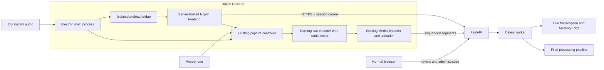

# Nojoin Electron-First Transition Plan

## 1. Goal

Make the Nojoin desktop application the canonical live-recording client while
preserving the self-hosted backend, worker pipeline, database, and browser-based
review and administration experience.

The first desktop implementation will use Electron as a secure shell around the
server-hosted Nojoin frontend. The Electron renderer will authenticate with the
normal Secure HttpOnly Nojoin session cookie and reuse the existing browser
capture controller, Web Audio mixer, segment uploader, pause/resume lifecycle,
live transcription lane, Meeting Edge flow, and final processing pipeline.

The transition must not recreate the retired Companion architecture. In
particular, the desktop app must not expose a browser-accessible localhost API,
issue a second long-lived Companion credential, install a local certificate
authority, or require a browser-to-native pairing state machine.

## 2. Product Outcome

At the end of the transition:

- Nojoin Desktop is the recommended client for live recording on supported
  desktop operating systems.
- Windows users can capture system output and microphone input without using
  Chrome as their normal browser.
- The desktop app remains usable while its window is hidden and provides native
  recording state, tray controls, notifications, and update handling.
- The existing web client remains available for review, playback, transcript
  editing, notes, search, tasks, people, calendar, administration, and mobile
  access.
- Browser capture remains available during the migration and is removed or
  reduced only after an explicit post-adoption decision.
- Desktop recordings continue to enter the same canonical 16 kHz, two-channel
  pipeline: channel 0 contains shared/system audio when available and channel 1
  contains microphone audio.
- Existing recordings and browser-created recordings require no data migration.

## 3. Locked Architecture Decisions

| ID | Decision | Value |
| --- | --- | --- |
| D1 | Product direction | Electron-first desktop client; not Electron-only |
| D2 | Server architecture | FastAPI, PostgreSQL, Redis, Celery workers, and Nginx remain server-side |
| D3 | Initial frontend delivery | Electron loads the server-hosted Nojoin HTTPS origin |
| D4 | Bundled frontend | Deferred; no embedded Next.js server or static frontend conversion in the initial transition |
| D5 | Authentication | Existing Secure HttpOnly browser session inside Electron |
| D6 | Native pairing | None; no Companion credential, pairing code, or device secret |
| D7 | Local control transport | No browser-accessible localhost HTTP or HTTPS service |
| D8 | Desktop capability boundary | Narrow, typed preload bridge plus Electron session handlers |
| D9 | Initial platform | Windows first |
| D10 | Later platforms | macOS and Linux are independent gated phases, not assumed from Windows success |
| D11 | Browser availability | Web review and administration remain supported permanently |
| D12 | Browser capture migration | Retained until desktop adoption, parity, and rollback requirements are met |
| D13 | Audio contract | Preserve separate system and microphone channels through the existing pipeline |
| D14 | TLS | Production desktop connections require an OS-trusted HTTPS certificate; no global certificate bypass |
| D15 | Version compatibility | Capability negotiation with a documented compatibility window; no brittle exact-version pairing |
| D16 | Release model | Desktop artifacts are versioned from the unified Nojoin release tag but may be rolled out behind a feature flag |

Changes to these decisions require an explicit architecture review and an
update to this document before implementation continues.

## 4. Target Architecture

### 4.1 Trust boundaries

- The configured Nojoin origin is remote content and receives no direct Node.js
  access.
- The renderer runs with Node integration disabled, context isolation enabled,
  and Chromium sandboxing enabled.
- The preload bridge exposes only versioned desktop capabilities required by
  Nojoin. It must never expose raw `ipcRenderer`, filesystem access, shell
  execution, environment variables, arbitrary URLs, or generic message passing.
- Every privileged request validates the sender frame, configured origin,
  schema, recording state, and expected user gesture where applicable.
- The normal Nojoin web session remains the sole user authentication path.
- System-audio capture is granted only to the configured Nojoin origin and only
  after an explicit user recording action.

## 5. Constraints and Non-Goals

- The Electron app does not host transcription, diarisation, LLM inference, or
  other heavy processing locally.
- The backend API and workers remain deployable without Electron artifacts.
- Nojoin Desktop is not an offline product; it requires a reachable Nojoin
  server for sign-in, upload, live guidance, and processing.
- The initial Windows implementation does not guarantee macOS or Linux capture
  parity.
- The initial implementation does not capture video or persist shared-screen
  imagery.
- The initial implementation does not add meeting-platform integrations,
  calendar-driven automatic recording, or background recording without an
  explicit user action.
- The initial implementation does not bypass invalid TLS certificates.
- The initial implementation does not move browser session tokens into custom
  desktop storage.
- The initial implementation does not remove browser capture.
- The initial implementation does not convert the Next.js frontend into a
  static SPA or package a local Next.js server inside Electron.

## 6. Waterfall Governance

Each phase has a hard exit gate. A later phase must not begin until all required
tasks in the current phase are complete, its automated and manual verification
is recorded, and its exit gate is approved.

Experimental code produced in a feasibility phase must not be treated as
production code unless the phase explicitly requires hardening and test
coverage. Any failed exit gate must produce a written decision to fix, revise
scope, or stop the transition.

---

## Phase A - Architecture, Threat Model, and Feasibility

**Objective:** Prove that Electron can securely load an arbitrary operator-
configured Nojoin deployment, authenticate through the existing session flow,
capture Windows system audio plus a selected microphone, and complete the
current recording lifecycle without native pairing.

### A.1 Architecture records

- [ ] A.1.1 Write an architecture decision record confirming the Electron-first,
      server-hosted frontend model and the reasons for rejecting a new paired
      background Companion.
- [ ] A.1.2 Document the desktop process model: Electron main process, sandboxed
      renderer, isolated preload bridge, media service, tray lifecycle, updater,
      and server-hosted frontend.
- [ ] A.1.3 Define the desktop capability protocol and assign an initial protocol
      version independent from the product version.
- [ ] A.1.4 Define which capabilities are implemented through Electron session
      handlers and which require explicit preload IPC.
- [ ] A.1.5 Define the compatibility policy between desktop and server releases,
      including the minimum supported desktop protocol and the number of prior
      desktop versions the server must tolerate.
- [ ] A.1.6 Define the browser-capture support policy during Alpha, Beta,
      recommended-desktop, and post-cutover stages.
- [ ] A.1.7 Record the explicit non-goal of browser-to-localhost control and add a
      review guard that rejects proposals which reintroduce it without a new
      security decision.

### A.2 Threat model

- [ ] A.2.1 Model compromise of the server-hosted frontend through XSS or a
      malicious reverse proxy response.
- [ ] A.2.2 Model navigation from the configured Nojoin origin to an attacker-
      controlled origin while the preload script remains installed.
- [ ] A.2.3 Model forged IPC messages, unexpected subframes, popup windows, and
      compromised renderer processes.
- [ ] A.2.4 Model misuse of microphone and system-audio permissions.
- [ ] A.2.5 Model malicious or accidental configuration of a non-Nojoin origin.
- [ ] A.2.6 Model invalid, expired, self-signed, and replaced TLS certificates.
- [ ] A.2.7 Model desktop update compromise, downgrade, rollback, and unsigned
      installer distribution.
- [ ] A.2.8 Model local exposure of logs, crash dumps, cached pages, cookies, and
      captured segment files.
- [ ] A.2.9 Model abrupt renderer failure, application termination, operating-
      system shutdown, suspend, and network loss during capture.
- [ ] A.2.10 Define mitigations and test obligations for every high or critical
      threat before the feasibility phase can pass.

### A.3 Windows feasibility spike

- [ ] A.3.1 Create a disposable Electron spike outside the production entry path.
- [ ] A.3.2 Load a local Nojoin deployment over HTTPS with Node integration
      disabled, context isolation enabled, and renderer sandboxing enabled.
- [ ] A.3.3 Complete normal Nojoin session login inside the Electron window and
      verify that unsafe cookie-authenticated requests pass existing trusted-
      origin enforcement without backend exceptions.
- [ ] A.3.4 Intercept `getDisplayMedia` through Electron and grant Windows system
      loopback audio only after the existing Start Meeting user action.
- [ ] A.3.5 Acquire the explicitly selected microphone through the existing strict
      `deviceId: { exact: ... }` path and fail closed when it is unavailable.
- [ ] A.3.6 Feed system and microphone streams into the existing two-channel
      mixer without changing source order or gain behavior.
- [ ] A.3.7 Upload sequenced segments using the existing session-authenticated
      `/recordings/init`, segment, pause, resume, discard, and finalize routes.
- [ ] A.3.8 Verify live waveform activity, Meeting Edge refresh, final transcript,
      source-channel analysis, and speaker processing on the resulting recording.
- [ ] A.3.9 Run an uninterrupted 60-minute recording and confirm duration drift,
      memory growth, CPU use, segment continuity, and finalization behavior.
- [ ] A.3.10 Change the Windows default output device during capture and record
      whether the Electron stream follows, stops, or requires a controlled
      restart.
- [ ] A.3.11 Confirm that hiding or minimising the window does not suspend audio
      capture, MediaRecorder callbacks, or uploads.
- [ ] A.3.12 Confirm that the spike never opens a localhost control listener and
      never mints a Companion-specific credential.

### A.4 TLS and self-hosting feasibility

- [ ] A.4.1 Test an installation with a publicly trusted certificate.
- [ ] A.4.2 Test an internal deployment whose private CA is installed in the
      operating-system trust store.
- [ ] A.4.3 Test the default self-signed localhost deployment and document the
      exact operator steps required to establish OS trust.
- [ ] A.4.4 Confirm that certificate errors fail closed and cannot be bypassed by
      renderer content.
- [ ] A.4.5 Decide whether the product will require trusted TLS for all desktop
      use or provide a separately reviewed certificate-import workflow.
- [ ] A.4.6 Explicitly reject global certificate verification overrides and
      automatic TOFU pinning unless the threat model is revised and approved.

### A.5 Feasibility verification

- [ ] A.5.1 Record the tested Electron, Chromium, Windows, microphone, output
      device, and Nojoin server versions.
- [ ] A.5.2 Preserve sanitized logs and recording identifiers for the spike.
- [ ] A.5.3 Compare the desktop recording against an equivalent current browser
      recording for channel layout, duration, live latency, and final output.
- [ ] A.5.4 Document blockers, revised assumptions, and accepted limitations.
- [ ] A.5.5 Remove or clearly quarantine disposable spike code before Phase B.

**Exit gate:** A signed-off feasibility report demonstrates an end-to-end
Windows recording through the current Nojoin pipeline, with normal session
authentication, separate system and microphone channels, no localhost control
service, and no unresolved critical threat-model finding.

---

## Phase B - Electron Application Foundation

**Objective:** Add a maintainable desktop application workspace, development
loop, process boundary, configuration model, and test harness without yet
changing the supported production capture path.

### B.1 Repository structure and tooling

- [ ] B.1.1 Add a top-level `desktop/` workspace with an Electron main process,
      preload entry point, shared protocol types, tests, and packaging config.
- [ ] B.1.2 Choose and document Electron Forge or an equivalent maintained build
      tool for packaging and release artifacts.
- [ ] B.1.3 Pin Electron and desktop dependencies through the existing lockfile
      strategy and configure automated dependency update review.
- [ ] B.1.4 Add development commands for starting the desktop shell against an
      operator-supplied local Nojoin origin.
- [ ] B.1.5 Add production build, package, unit-test, lint, and type-check commands.
- [ ] B.1.6 Ensure desktop build output, package caches, signing material, and
      local application configuration are excluded from Git and Docker build
      contexts where appropriate.
- [ ] B.1.7 Confirm the API and worker Docker images do not gain Electron, Node
      desktop, or packaging dependencies.

### B.2 Application process model

- [ ] B.2.1 Implement a single-instance Electron main process.
- [ ] B.2.2 Create the primary `BrowserWindow` with Node integration disabled,
      context isolation enabled, sandboxing enabled, and background throttling
      behavior explicitly configured and tested.
- [ ] B.2.3 Add a minimal preload entry point that exports no capability until
      the configured origin has been validated.
- [ ] B.2.4 Define typed request and response schemas for every desktop
      capability and reject unknown fields.
- [ ] B.2.5 Validate the sender frame and exact configured origin for every IPC
      handler.
- [ ] B.2.6 Block unapproved child windows, popups, downloads, permission
      requests, navigations, and external protocol launches.
- [ ] B.2.7 Open approved external links in the operating-system default browser
      after validating their schemes.
- [ ] B.2.8 Add application lifecycle handling for normal quit, update restart,
      operating-system shutdown, and unexpected renderer termination.

### B.3 Local configuration

- [ ] B.3.1 Define a versioned desktop configuration schema containing only the
      configured Nojoin origin, window preferences, update channel, and
      non-sensitive desktop preferences.
- [ ] B.3.2 Canonicalize the configured origin to an exact HTTPS origin with no
      path, query, fragment, embedded credentials, or non-web scheme.
- [ ] B.3.3 Reject HTTP except for an explicit development-only loopback mode
      that cannot be enabled in production packages.
- [ ] B.3.4 Store configuration in the Electron per-user application data
      directory with user-only permissions where supported.
- [ ] B.3.5 Implement atomic configuration writes and recovery from malformed or
      partially written configuration.
- [ ] B.3.6 Keep browser cookies in Electron's Chromium session storage rather
      than copying session tokens into the desktop configuration.
- [ ] B.3.7 Add an explicit Reset Desktop App action that clears local desktop
      configuration and the Electron session without modifying server data.

### B.4 Desktop diagnostics

- [ ] B.4.1 Add structured desktop logging with rotation and user-only file
      permissions.
- [ ] B.4.2 Redact cookies, authorization headers, JWT-shaped strings, URLs with
      credentials, API keys, and sensitive form values.
- [ ] B.4.3 Add a diagnostics summary containing desktop version, protocol
      version, operating system, architecture, configured origin, permission
      states, and capture capability state without recording audio content.
- [ ] B.4.4 Add an in-app action to open or export sanitized desktop logs.
- [ ] B.4.5 Ensure crashes and unhandled promise rejections do not write captured
      segment bytes or secrets into logs.

### B.5 Foundation tests and documentation

- [ ] B.5.1 Unit-test origin canonicalization and rejection cases.
- [ ] B.5.2 Unit-test IPC schema validation and sender-origin enforcement.
- [ ] B.5.3 Unit-test configuration migration, atomic write, reset, and malformed
      file recovery.
- [ ] B.5.4 Add an Electron smoke test which launches against a fixture origin
      and verifies sandbox, context isolation, and navigation restrictions.
- [ ] B.5.5 Document desktop development prerequisites and commands in
      `docs/DEVELOPMENT.md`.
- [ ] B.5.6 Add the desktop workspace to contributor and security review guidance.

**Exit gate:** The repository builds and tests a sandboxed Electron shell which
loads only a configured HTTPS Nojoin origin, persists no authentication token
outside Chromium's session, exposes no recording capability yet, and adds no
desktop dependency to backend or worker images.

---

## Phase C - Secure Server-Hosted Frontend Integration

**Objective:** Make the Electron shell a first-class client of the existing
server-hosted frontend while keeping normal browser behavior unchanged.

### C.1 First-run connection flow

- [ ] C.1.1 Add a local, bundled first-run screen for entering the Nojoin server
      origin before any remote content is loaded.
- [ ] C.1.2 Validate HTTPS, certificate trust, API health, and expected Nojoin
      server identity before saving the origin.
- [ ] C.1.3 Show clear, non-technical failures for DNS, timeout, TLS trust,
      reverse-proxy host mismatch, unsupported server version, and non-Nojoin
      responses.
- [ ] C.1.4 Require explicit user confirmation before replacing an already
      configured Nojoin origin.
- [ ] C.1.5 Block origin switching while a recording is active, paused locally,
      finalizing, or waiting for upload completion.
- [ ] C.1.6 Preserve the old origin and session until a new origin passes
      validation and the user confirms the change.

### C.2 Session and navigation integration

- [ ] C.2.1 Load the exact configured Nojoin web origin in the primary window.
- [ ] C.2.2 Verify the existing `/login/session` flow sets and reuses the Secure
      HttpOnly cookie inside the Electron partition.
- [ ] C.2.3 Verify logout invalidates the server token and clears the desktop
      session exactly as it does in a normal browser.
- [ ] C.2.4 Confirm password rotation, deactivation, revoke-all, invitation,
      first-run bootstrap, and forced-password-change policies behave unchanged.
- [ ] C.2.5 Preserve calendar OAuth by opening provider authorization in the
      system browser or a tightly isolated flow and returning only to the
      configured Nojoin callback origin.
- [ ] C.2.6 Verify downloads, uploads, document selection, backup import/export,
      and transcript exports have explicit desktop behavior.
- [ ] C.2.7 Handle session expiry by returning to the normal Nojoin login screen
      without losing paused-recording recovery state.

### C.3 Capability and version negotiation

- [ ] C.3.1 Define a read-only desktop capability object exposed to the frontend,
      including desktop version, protocol version, operating system,
      architecture, capture support, updater support, and tray support.
- [ ] C.3.2 Add shared TypeScript definitions for the capability object; do not
      use `any` or untyped global properties.
- [ ] C.3.3 Add a backend or frontend compatibility policy which can distinguish
      supported, update-recommended, update-required, and unsupported desktop
      versions.
- [ ] C.3.4 Ensure capability detection fails safely to normal browser behavior
      when the preload bridge is absent or malformed.
- [ ] C.3.5 Add a desktop source identifier to capture-source diagnostics without
      weakening ownership or session checks.
- [ ] C.3.6 Display desktop and server versions in Settings > Updates with clear
      distinction between the two artifacts.

### C.4 Deep links and single-instance behavior

- [ ] C.4.1 Register a versioned `nojoin://open` deep link which contains only
      non-secret navigation intent and an optional HTTPS origin.
- [ ] C.4.2 Never place session tokens, authorization codes, API keys, recording
      credentials, or pairing secrets in deep-link parameters.
- [ ] C.4.3 Validate and canonicalize every deep-link origin and route before use.
- [ ] C.4.4 Route deep links to the existing desktop instance and focus the
      relevant Nojoin page.
- [ ] C.4.5 Ignore or safely reject deep links while an origin switch or
      incompatible recording transition would be unsafe.
- [ ] C.4.6 Add Windows protocol registration and uninstall cleanup tests.

### C.5 Frontend integration tests

- [ ] C.5.1 Test desktop capability detection and normal-browser fallback.
- [ ] C.5.2 Test server-supported, update-recommended, and update-required
      compatibility states.
- [ ] C.5.3 Test navigation blocking, external-link handling, popups, and
      cross-origin redirects.
- [ ] C.5.4 Test login persistence across app restart and logout invalidation.
- [ ] C.5.5 Run `cd frontend && npm run build` after frontend integration changes.

**Exit gate:** Nojoin Desktop can connect to a trusted deployment, complete all
normal authentication flows, safely load the server-hosted frontend, negotiate
capabilities, and handle navigation and deep links without exposing recording
or generic native privileges.

---

## Phase D - Windows Capture MVP

**Objective:** Make the Windows Electron app capable of completing the current
Nojoin recording workflow with system-loopback and microphone audio while
preserving current browser capture as the production fallback.

### D.1 Capture abstraction

- [ ] D.1.1 Refactor `frontend/src/lib/capture/` around a typed capture-source
      adapter without changing browser behavior.
- [ ] D.1.2 Keep the current browser adapter responsible for `getDisplayMedia`,
      `getUserMedia`, browser picker cancellation, and mobile microphone mode.
- [ ] D.1.3 Add an Electron Windows adapter selected only when the validated
      desktop capability object reports Windows loopback support.
- [ ] D.1.4 Keep mixer, waveform, recorder, uploader, lifecycle, and controller
      interfaces shared unless a demonstrated platform requirement prevents it.
- [ ] D.1.5 Preserve strict selected-microphone enforcement across both browser
      and Electron adapters.
- [ ] D.1.6 Preserve intentional start cancellation as a silent rollback of the
      provisional recording.
- [ ] D.1.7 Preserve existing error codes where semantics match and add
      desktop-specific codes only for actionable desktop failures.

### D.2 Electron media permission handling

- [ ] D.2.1 Install a display-media request handler for only the configured
      Nojoin origin.
- [ ] D.2.2 Require a short-lived main-process record of an explicit Start or
      Resume user gesture before granting system-loopback capture.
- [ ] D.2.3 Reject requests from subframes, popups, unexpected windows,
      background pages, or origins other than the configured Nojoin origin.
- [ ] D.2.4 Grant Windows loopback audio and the minimum disposable video track
      required by Electron/Chromium, then stop or ignore video immediately.
- [ ] D.2.5 Ensure Nojoin never uploads, stores, previews, or logs captured video
      frames.
- [ ] D.2.6 Route microphone permission through the normal media permission
      handler and exact selected-device constraints.
- [ ] D.2.7 Report denied, unavailable, muted, ended, and mismatched media tracks
      using sanitized source diagnostics.

### D.3 Audio contract

- [ ] D.3.1 Connect loopback audio to mixer channel 0 and microphone audio to
      mixer channel 1.
- [ ] D.3.2 Preserve per-source manual gain and automatic gain behavior.
- [ ] D.3.3 Preserve browser echo cancellation, noise suppression, and automatic
      gain control settings for the microphone where Electron exposes them.
- [ ] D.3.4 Verify the output `MediaStream` is two-channel before recording and
      fail closed if channel separation cannot be established.
- [ ] D.3.5 Verify MediaRecorder selects a worker-supported WebM/Opus, Ogg/Opus,
      or MP4 audio format and records with stable timeslices.
- [ ] D.3.6 Verify worker transcode preserves the expected source channels and
      source-channel analysis reports meaningful non-silent coverage.
- [ ] D.3.7 Detect silence independently on the system and microphone channels and
      surface actionable guidance before a long recording is lost.

### D.4 Recording lifecycle

- [ ] D.4.1 Start a desktop recording through the existing `/recordings/init`
      route using the normal session cookie.
- [ ] D.4.2 Upload segments with monotonically increasing 0-based sequence
      numbers through the existing uploader.
- [ ] D.4.3 Pause locally before marking the backend recording `PAUSED` and
      preserve the last acknowledged sequence.
- [ ] D.4.4 Resume by validating the backend `last_sequence`, reacquiring required
      streams, and continuing at `last_sequence + 1`.
- [ ] D.4.5 Finalize only after all queued segment uploads and transcodes have
      settled.
- [ ] D.4.6 Discard both local pending state and server-side upload artifacts
      through the existing discard route.
- [ ] D.4.7 Handle the system track ending by finalizing or pausing according to
      an explicitly approved desktop policy.
- [ ] D.4.8 Keep the one-active-or-paused-recording-per-user guard unchanged.
- [ ] D.4.9 Reconcile desktop state against backend state at app startup, login,
      resume, logout, server switch, and update restart.

### D.5 Windows capture settings

- [ ] D.5.1 Enumerate microphones and output devices with stable display names
      where the platform allows it.
- [ ] D.5.2 Store desktop capture settings separately from normal browser local
      storage while preserving the same user-visible settings model.
- [ ] D.5.3 Fail closed when an explicitly selected microphone is unavailable or
      does not match the granted track.
- [ ] D.5.4 Define and test behavior when the selected output device disappears or
      the Windows default output device changes.
- [ ] D.5.5 Add a desktop microphone test and system-audio test that do not create
      a server recording or retain audio.
- [ ] D.5.6 Ensure test meters release all media tracks and resources when the
      settings page is left.

### D.6 Automated and manual verification

- [ ] D.6.1 Add unit tests for adapter selection and browser fallback.
- [ ] D.6.2 Add unit tests for desktop permission gating and stale user gestures.
- [ ] D.6.3 Add focused capture tests for start, silent cancel, strict microphone,
      pause, resume, stop, finalize, discard, and track-ended behavior.
- [ ] D.6.4 Run `cd frontend && npm run test -- --run src/lib/capture`.
- [ ] D.6.5 Run `cd frontend && npm run build`.
- [ ] D.6.6 Run targeted backend tests for init, segment upload, pause/resume,
      transcode, live transcription, chunk synchronization, discard, and
      finalize.
- [ ] D.6.7 Manually validate Google Meet, Microsoft Teams, Zoom, and a generic
      media source on supported Windows versions.
- [ ] D.6.8 Manually verify headset, speakers, Bluetooth output, USB microphone,
      built-in microphone, output-device switch, and microphone disconnect.
- [ ] D.6.9 Verify waveform, Meeting Edge, notes, final transcript, speaker
      continuity, playback, and export.

**Exit gate:** A feature-flagged Windows desktop build records reliable,
separate system and microphone audio through the current backend lifecycle and
passes focused automated tests plus the approved manual Windows matrix.

---

## Phase E - Desktop Lifecycle, Tray, and Recovery

**Objective:** Make desktop capture resilient to normal desktop behavior,
temporary network loss, hidden windows, application lifecycle events, and
recoverable failures.

### E.1 Window and tray behavior

- [ ] E.1.1 Define close-button behavior separately for idle, recording, paused,
      uploading, and finalizing states.
- [ ] E.1.2 Keep capture and upload active when the main window is hidden or
      minimized.
- [ ] E.1.3 Add a tray icon with status-only text and minimal Start/Open,
      Pause/Resume, Stop, and Quit actions.
- [ ] E.1.4 Ensure tray actions call the same capture controller state machine as
      the web UI rather than implementing parallel recording logic.
- [ ] E.1.5 Require confirmation before an explicit Quit would discard an
      in-memory tail or interrupt pending uploads.
- [ ] E.1.6 Show native notifications for recording started, paused, resumed,
      finalized, failed, and recovered states without exposing transcript or
      meeting content.
- [ ] E.1.7 Add an optional, explicit run-on-login setting which defaults off.

### E.2 Power, suspend, and shutdown

- [ ] E.2.1 Use the operating-system power blocker only while actively recording
      or finalizing and release it on every terminal path.
- [ ] E.2.2 Detect suspend and attempt a bounded pause with backend state update.
- [ ] E.2.3 Reconcile state after resume and require the user to reacquire media
      when the operating system invalidates tracks.
- [ ] E.2.4 Handle Windows session ending and shutdown with a best-effort pause
      that does not delay shutdown indefinitely.
- [ ] E.2.5 Ensure unexpected shutdown leaves the backend recording recoverable
      through the existing resume-or-discard guard.

### E.3 Network interruption and local spool

- [ ] E.3.1 Define maximum in-memory upload backlog, retry intervals, and the
      point at which capture must pause to prevent unbounded memory growth.
- [ ] E.3.2 Decide whether production reliability requires an on-disk encrypted
      segment spool or whether bounded in-memory retry is sufficient.
- [ ] E.3.3 If disk spooling is approved, expose a narrow segment persistence API
      rather than renderer filesystem access.
- [ ] E.3.4 Store spooled segments under a per-user, per-recording directory with
      restrictive permissions and opaque filenames.
- [ ] E.3.5 Persist sequence, checksum, upload acknowledgement, and recording
      identity atomically without persisting browser session tokens.
- [ ] E.3.6 Delete acknowledged segments promptly and remove all local capture
      material after finalize or discard.
- [ ] E.3.7 Reconcile an interrupted spool with backend chunk state before retrying
      to avoid duplicate or missing sequence rows.
- [ ] E.3.8 Cap disk usage and fail closed with clear recovery instructions when
      the cap or available storage threshold is reached.
- [ ] E.3.9 Add cleanup for abandoned terminal-state spools while retaining
      recoverable paused data.

### E.4 Crash recovery

- [ ] E.4.1 Detect renderer crashes and mark active capture state as degraded.
- [ ] E.4.2 Attempt a bounded backend pause without automatically restarting
      capture or reacquiring permissions.
- [ ] E.4.3 Restore the UI into the existing resume-or-discard workflow after the
      renderer relaunches.
- [ ] E.4.4 Detect main-process crashes on the next launch through an atomic
      active-session marker and reconcile against backend state.
- [ ] E.4.5 Ensure recovery never silently starts microphone or system capture.

### E.5 Reliability verification

- [ ] E.5.1 Run a two-hour uninterrupted recording and record memory, CPU, disk,
      upload latency, live latency, and duration drift.
- [ ] E.5.2 Test 30-second, 5-minute, and extended network interruptions.
- [ ] E.5.3 Test API restart, worker restart, reverse-proxy restart, and temporary
      server unavailability during capture.
- [ ] E.5.4 Test renderer crash, main-process termination, application update
      restart, Windows sign-out, suspend/resume, and controlled shutdown.
- [ ] E.5.5 Test close-to-tray and tray controls throughout recording lifecycle.
- [ ] E.5.6 Verify no acknowledged local segment remains after successful
      finalize or discard.

**Exit gate:** The Windows desktop app survives the approved lifecycle and
network failure matrix without silent data loss, unbounded resource growth,
duplicate sequence creation, unauthorized capture restart, or unrecoverable
backend recording state.

---

## Phase F - Security Hardening and Release Readiness

**Objective:** Convert the feature-complete Windows client into a defensible
production application with a reviewed remote-content boundary and signed
update path.

### F.1 Electron hardening

- [ ] F.1.1 Apply Electron security fuses to disable unused or dangerous runtime
      behavior.
- [ ] F.1.2 Confirm Node integration is disabled in the main renderer, subframes,
      workers, previews, and any auxiliary window.
- [ ] F.1.3 Confirm context isolation and sandboxing cannot be disabled through
      operator configuration or remote content.
- [ ] F.1.4 Install explicit permission handlers for media, notifications,
      clipboard, downloads, fullscreen, and every permission reachable from the
      loaded frontend.
- [ ] F.1.5 Deny all permissions not required by a documented Nojoin workflow.
- [ ] F.1.6 Restrict navigation, redirects, popups, new windows, webviews,
      external protocols, and downloads to reviewed handlers.
- [ ] F.1.7 Validate IPC sender origin, top-level frame, message schema,
      recording state, and capability version on every call.
- [ ] F.1.8 Audit the preload bundle to ensure no generic Electron primitive is
      reachable from remote content.
- [ ] F.1.9 Keep `webSecurity` enabled and prohibit insecure-content and
      certificate-verification bypass flags in production builds.

### F.2 Application and dependency security

- [ ] F.2.1 Add dependency vulnerability scanning for Electron, Node packages,
      packaging tools, and transitive desktop dependencies.
- [ ] F.2.2 Define a maximum response time for Electron/Chromium security updates.
- [ ] F.2.3 Generate an SBOM and checksums for desktop release artifacts.
- [ ] F.2.4 Audit logs, crash reports, config, Chromium storage, spool files, and
      update metadata for sensitive-data leakage.
- [ ] F.2.5 Verify logout, password change, user deactivation, revoke-all, and
      server signing-key changes invalidate desktop access as expected.
- [ ] F.2.6 Verify desktop capture cannot start before login, during forced
      password change, or after account deactivation.
- [ ] F.2.7 Conduct a focused security review of remote-content compromise,
      permission escalation, deep links, updater, and local file handling.
- [ ] F.2.8 Resolve all critical and high findings; document accepted lower-risk
      findings with owner and review date.

### F.3 Privacy and legal UX

- [ ] F.3.1 Present explicit operating-system and in-app recording indicators.
- [ ] F.3.2 Keep visible Stop controls available in the window and tray while
      capture is active.
- [ ] F.3.3 Confirm system audio and microphone are released on stop, discard,
      logout, origin reset, incompatible update, and terminal error.
- [ ] F.3.4 Update recording-law and privacy copy for desktop system-loopback
      capture.
- [ ] F.3.5 Confirm diagnostics and notifications do not disclose meeting
      content by default.

### F.4 Security documentation and verification

- [ ] F.4.1 Update `docs/SECURITY.md` with desktop trust boundaries, remote
      content controls, TLS requirements, update verification, and local data.
- [ ] F.4.2 Add desktop security review instructions to contributor guidance.
- [ ] F.4.3 Add tests that assert production BrowserWindow and session security
      options.
- [ ] F.4.4 Add negative tests for malicious origin, cross-origin iframe,
      malformed deep link, arbitrary IPC, unsafe external URL, denied media,
      and invalid certificate scenarios.

**Exit gate:** The threat model is updated with implementation evidence, all
critical and high findings are closed, production security configuration is
tested, and the release path rejects unsigned or untrusted application code.

---

## Phase G - Windows Packaging, Signing, and Updates

**Objective:** Produce supportable Windows installers and a safe desktop update
channel integrated with Nojoin's existing release model.

### G.1 Packaging decisions

- [ ] G.1.1 Select the Windows installer format after testing install,
      per-user/system scope, protocol registration, auto-update, repair, and
      uninstall behavior.
- [ ] G.1.2 Produce x64 first and record whether Windows on ARM runs through
      emulation or requires a separate arm64 artifact.
- [ ] G.1.3 Configure application identity, publisher, icons, metadata, license,
      uninstall entry, protocol handler, and per-user data paths.
- [ ] G.1.4 Ensure uninstall removes executables and protocol registration while
      offering a clear choice about local non-secret preferences and logs.
- [ ] G.1.5 Ensure uninstall never modifies the Nojoin server or deletes server-
      side recordings.

### G.2 Signing and provenance

- [ ] G.2.1 Select and provision a Windows code-signing method and protect signing
      credentials in CI secrets or delegated signing infrastructure.
- [ ] G.2.2 Sign executables, installer artifacts, and update packages.
- [ ] G.2.3 Timestamp signatures and verify them on a clean Windows machine.
- [ ] G.2.4 Publish SHA-256 checksums and SBOMs alongside release artifacts.
- [ ] G.2.5 Verify release artifacts originate from the tagged commit and the CI
      build is reproducible enough to audit inputs and versions.

### G.3 Desktop update flow

- [ ] G.3.1 Define stable, beta, and development update channels.
- [ ] G.3.2 Publish signed update metadata and packages from the unified release
      workflow.
- [ ] G.3.3 Verify the updater rejects unsigned, altered, downgraded, wrong-
      channel, and incompatible packages.
- [ ] G.3.4 Prevent automatic restart while recording, paused with local data,
      uploading, or finalizing.
- [ ] G.3.5 Allow update download during idle use and require a safe explicit or
      idle restart point.
- [ ] G.3.6 Implement update rollback guidance and preserve desktop configuration
      across compatible downgrades.
- [ ] G.3.7 Define emergency update and revoked-release procedures.

### G.4 Release workflow integration

- [ ] G.4.1 Extend `.github/workflows/release.yml` with Windows desktop build,
      test, package, sign, checksum, SBOM, and publish jobs.
- [ ] G.4.2 Keep API, worker, frontend, and desktop versions derived from the same
      `vX.Y.Z` tag while preserving separate runtime capability versions.
- [ ] G.4.3 Surface desktop downloads and release notes in Settings > Updates
      without requiring Docker daemon access.
- [ ] G.4.4 Add release-note sections for server changes, desktop changes,
      platform support, required updates, and known capture limitations.
- [ ] G.4.5 Add clean-machine installation, upgrade, downgrade, repair, and
      uninstall jobs or documented manual gates.

### G.5 Windows documentation

- [ ] G.5.1 Add a desktop installation and first-connection guide.
- [ ] G.5.2 Document trusted TLS requirements for public, private-CA, and local
      deployments.
- [ ] G.5.3 Document Windows microphone, system-audio, tray, startup, update,
      diagnostics, and recovery behavior.
- [ ] G.5.4 Add operator guidance for distributing the desktop app in managed
      environments.
- [ ] G.5.5 Add support instructions for collecting sanitized desktop and server
      logs together.

**Exit gate:** A signed Windows installer can be installed, updated, rolled
back according to policy, and uninstalled on clean supported systems; released
artifacts have checksums and provenance; updates never interrupt active capture.

---

## Phase H - Windows Alpha, Beta, and Recommended Rollout

**Objective:** Introduce Electron without removing the existing browser path,
gather operational evidence, and promote it only after reliability and support
criteria are met.

### H.1 Alpha rollout

- [ ] H.1.1 Gate desktop-specific UI and downloads behind an explicit Alpha
      setting or release channel.
- [ ] H.1.2 Limit Alpha support to documented Windows versions and architectures.
- [ ] H.1.3 Keep browser capture unchanged and clearly available as rollback.
- [ ] H.1.4 Collect opt-in, privacy-preserving diagnostics or structured manual
      reports for start failures, missing channels, upload recovery, crashes,
      and finalize failures.
- [ ] H.1.5 Triage every data-loss or unauthorized-capture report as a release
      blocker.

### H.2 Beta rollout

- [ ] H.2.1 Resolve Alpha blockers and publish a known-issues list.
- [ ] H.2.2 Expand device coverage across integrated, USB, Bluetooth, docking-
      station, and virtual audio devices.
- [ ] H.2.3 Validate remote, LAN, VPN, reverse-proxy, private-CA, and localhost
      server deployments.
- [ ] H.2.4 Validate multiple Windows user accounts and least-privilege installs.
- [ ] H.2.5 Measure support burden against browser capture and the historical
      Companion failure classes.
- [ ] H.2.6 Confirm the desktop/server compatibility window works across at least
      one supported staggered update in each direction.

### H.3 Recommended-client promotion

- [ ] H.3.1 Define quantitative promotion thresholds for successful starts,
      recordings without channel loss, finalized recordings, crash-free
      sessions, and support incidents.
- [ ] H.3.2 Complete the Windows manual sign-off matrix in Section 8.
- [ ] H.3.3 Make Nojoin Desktop the recommended Windows recording path.
- [ ] H.3.4 Update browser UI to offer Open in Nojoin Desktop while preserving a
      clearly labeled browser-capture fallback.
- [ ] H.3.5 Update onboarding, README, Getting Started, Usage, Capture,
      Architecture, Deployment, Development, Administration, PRD, and Security
      documentation in the same release.
- [ ] H.3.6 Publish migration and rollback guidance; do not require users to
      uninstall or alter existing recordings.

**Exit gate:** Windows production metrics and manual validation meet the
approved thresholds, Nojoin Desktop is documented as the recommended Windows
recording client, and browser capture remains a tested rollback path.

---

## Phase I - macOS Desktop Support

**Objective:** Add a separately validated macOS implementation without assuming
Windows loopback behavior or weakening macOS permission and release controls.

### I.1 Platform scope

- [ ] I.1.1 Define the minimum supported macOS version based on reliable system-
      audio APIs and Electron support.
- [ ] I.1.2 Decide whether to ship separate x64 and arm64 packages or a universal
      application.
- [ ] I.1.3 Document unsupported older macOS versions and virtual-audio-device
      requirements, if any.

### I.2 macOS capture implementation

- [ ] I.2.1 Add required microphone, screen recording, and system-audio usage
      descriptions and entitlements.
- [ ] I.2.2 Implement and validate Electron/Chromium CoreAudio capture for the
      supported macOS baseline.
- [ ] I.2.3 Detect absent, denied, stale, or partially granted permissions and
      provide exact recovery guidance.
- [ ] I.2.4 Preserve system audio on channel 0 and microphone audio on channel 1.
- [ ] I.2.5 Verify native meeting applications, browser meeting tabs, headphones,
      built-in speakers, Bluetooth devices, and aggregate devices.
- [ ] I.2.6 Detect dead or silent audio streams produced by incomplete macOS
      permission configuration.
- [ ] I.2.7 Validate output-device switching and sleep/wake behavior.

### I.3 macOS packaging and release

- [ ] I.3.1 Configure macOS packaging, application identity, icons, protocol
      registration, and update metadata.
- [ ] I.3.2 Enrol and configure Apple code signing.
- [ ] I.3.3 Sign hardened-runtime application artifacts and required helpers.
- [ ] I.3.4 Notarize release artifacts and staple notarization results.
- [ ] I.3.5 Test Gatekeeper behavior on clean Intel and Apple Silicon systems.
- [ ] I.3.6 Test signed updates, rollback policy, uninstall, and local-data
      retention.

### I.4 macOS verification and documentation

- [ ] I.4.1 Run focused capture and frontend build tests.
- [ ] I.4.2 Complete the macOS manual matrix in Section 8.
- [ ] I.4.3 Add macOS permission, capture, installation, update, and
      troubleshooting documentation.
- [ ] I.4.4 Promote macOS only after its own Alpha and Beta gates; Windows
      production status does not waive them.

**Exit gate:** Signed and notarized macOS builds pass the supported-version and
device matrix with reliable separate system and microphone channels and clear
fail-closed permission recovery.

---

## Phase J - Linux Desktop Support

**Objective:** Add a separately validated Linux implementation around PipeWire
and desktop portals while documenting unavoidable distribution and environment
variation.

### J.1 Platform scope

- [ ] J.1.1 Define the initially supported distributions, versions, desktop
      environments, architectures, display servers, and package formats.
- [ ] J.1.2 Require a working PipeWire and XDG Desktop Portal capture path for
      supported system-audio recording.
- [ ] J.1.3 Define explicit unsupported behavior for PulseAudio-only or broken
      portal environments.
- [ ] J.1.4 Decide whether x64 is the initial architecture and whether arm64 is a
      later package target.

### J.2 Linux capture implementation

- [ ] J.2.1 Validate Electron display-media behavior under Wayland and X11.
- [ ] J.2.2 Implement portal-mediated source selection without bypassing desktop
      consent controls.
- [ ] J.2.3 Detect when the selected source lacks an audio track and fail before
      recording rather than silently producing microphone-only output.
- [ ] J.2.4 Preserve system audio on channel 0 and microphone audio on channel 1.
- [ ] J.2.5 Validate GNOME and KDE PipeWire behavior, including window/screen
      source differences.
- [ ] J.2.6 Validate default-output changes, USB/Bluetooth devices, suspend, and
      portal cancellation.
- [ ] J.2.7 Decide whether any native PipeWire helper is justified; require a new
      architecture and security review before adding one.

### J.3 Linux packaging and updates

- [ ] J.3.1 Produce the approved AppImage, deb, rpm, Flatpak, or other selected
      artifacts without claiming unsupported package formats.
- [ ] J.3.2 Define signing, checksum, repository, and update behavior separately
      for each package type.
- [ ] J.3.3 Validate desktop entries, protocol registration, sandbox/portal
      integration, tray behavior, and uninstall cleanup.
- [ ] J.3.4 Document environments where auto-update is unavailable and package-
      manager updates are required.

### J.4 Linux verification and documentation

- [ ] J.4.1 Run focused capture and frontend build tests.
- [ ] J.4.2 Complete the Linux manual matrix in Section 8.
- [ ] J.4.3 Add Linux installation, PipeWire, portal, permission, package,
      update, and troubleshooting guidance.
- [ ] J.4.4 Promote Linux only after its own Alpha and Beta gates.

**Exit gate:** Supported Linux packages pass the approved PipeWire, portal,
desktop-environment, display-server, and device matrix with truthful failure
messages for unsupported environments.

---

## Phase K - Electron-First Product Cutover

**Objective:** Align product copy, support policy, deployment guidance, and
release operations around Nojoin Desktop as the canonical desktop recorder
without unnecessarily removing the web application.

### K.1 Product and navigation cutover

- [ ] K.1.1 Update the root README and documentation index to introduce Nojoin
      Desktop as the recommended desktop recording client.
- [ ] K.1.2 Update dashboard and capture entry points to prefer Open in Nojoin
      Desktop when a supported desktop package is available.
- [ ] K.1.3 Keep browser playback, review, transcript editing, notes, search,
      tasks, people, calendar, settings, and administration fully supported.
- [ ] K.1.4 Keep mobile browser behavior explicit and do not imply that Electron
      affects mobile capture capabilities.
- [ ] K.1.5 Ensure all unsupported-platform and no-desktop-installed states have
      a usable browser fallback or clear installation path.

### K.2 Browser capture disposition

- [ ] K.2.1 Review desktop adoption, reliability, support burden, and remaining
      browser-only use cases after at least one stable desktop release cycle.
- [ ] K.2.2 Choose and document one policy: retain full browser capture, retain
      best-effort browser capture, reduce browser capture to microphone-only, or
      schedule browser capture retirement.
- [ ] K.2.3 If behavior is removed, provide at least one deprecation release with
      in-product notice and rollback guidance.
- [ ] K.2.4 Do not remove shared capture modules that remain required by Electron
      until the desktop adapter owns equivalent tested behavior.
- [ ] K.2.5 Update tests and support messaging to match the chosen policy without
      leaving stale browser or Companion claims.

### K.3 Documentation propagation

- [ ] K.3.1 Update `README.md` support matrix, Quick Start, and documentation
      links.
- [ ] K.3.2 Update `docs/ARCHITECTURE.md` system components, trust boundaries,
      recording flow, authentication model, and release model.
- [ ] K.3.3 Replace or expand `docs/CAPTURE.md` into desktop and browser capture
      sections with per-platform troubleshooting.
- [ ] K.3.4 Update `docs/GETTING_STARTED.md` with desktop installation and server
      connection steps.
- [ ] K.3.5 Update `docs/DEPLOYMENT.md` with trusted TLS, desktop artifact, reverse-
      proxy, compatibility, and update requirements.
- [ ] K.3.6 Update `docs/DEVELOPMENT.md` with Electron commands, test matrices,
      packaging prerequisites, and signing boundaries.
- [ ] K.3.7 Update `docs/PRD.md` to make the desktop client a first-class system
      component while preserving web access.
- [ ] K.3.8 Update `docs/USAGE.md` with desktop onboarding, tray, permissions,
      recovery, updates, and browser fallback.
- [ ] K.3.9 Update `docs/ADMIN.md` with desktop support and diagnostics procedures.
- [ ] K.3.10 Update `docs/SECURITY.md` with the final reviewed desktop security
      model.
- [ ] K.3.11 Update screenshots and guided tours where the capture entry point or
      platform messaging changes.

### K.4 Operational sign-off

- [ ] K.4.1 Verify backup and restore behavior remains server-centered and no
      desktop-local state is falsely presented as backed up.
- [ ] K.4.2 Verify existing and historical recordings remain accessible without
      migration.
- [ ] K.4.3 Verify server upgrades do not require desktop installation for admin,
      restore, or recovery operations.
- [ ] K.4.4 Publish support boundaries for desktop versions, server versions,
      operating systems, package types, and TLS configurations.
- [ ] K.4.5 Publish release notes and operator migration guidance for the
      Electron-first release.
- [ ] K.4.6 Confirm rollback to browser-first messaging does not require a data or
      schema rollback.

**Exit gate:** Nojoin Desktop is the canonical documented desktop recording
client, supported platforms have completed their independent gates, web review
and administration remain functional, and the chosen browser-capture policy is
explicit, tested, and reversible.

## 7. Backend and Data Compatibility Requirements

- [ ] Preserve recording ownership checks on every desktop-created recording.
- [ ] Preserve current active/paused recording conflict behavior.
- [ ] Preserve 0-based contiguous segment sequence requirements.
- [ ] Preserve browser-supported segment MIME types and worker-side transcode.
- [ ] Preserve current live ASR and diarisation lane-state tracking.
- [ ] Preserve current source-channel contract and final alignment rules.
- [ ] Preserve existing recording `public_id` and `meeting_uid` behavior.
- [ ] Avoid database migrations unless desktop capability or release metadata
      demonstrably requires persisted server state.
- [ ] If persisted desktop state is introduced, scope it to user-owned device
      metadata and provide explicit revocation, retention, backup, and restore
      behavior.
- [ ] Keep heavy media and ML processing in Celery workers rather than Electron
      or API request handlers.

## 8. Manual Validation Matrices

### 8.1 Common scenario matrix

Every supported platform/device combination must run these scenarios:

- [ ] Start, observe both source levels, and silently cancel before capture.
- [ ] Start with system audio and the explicitly selected microphone.
- [ ] Reject an unavailable explicitly selected microphone without fallback.
- [ ] Record for 10 minutes and finalize successfully.
- [ ] Pause for 30 seconds, resume, and verify contiguous segment numbering.
- [ ] Hide/minimize the desktop window and continue recording.
- [ ] Control pause, resume, and stop from the tray.
- [ ] Lose network access, recover, and verify no missing or duplicate segments.
- [ ] Restart the API and reverse proxy during capture and recover.
- [ ] Disconnect and reconnect the microphone.
- [ ] Change the default output device.
- [ ] Suspend and resume the operating system.
- [ ] Terminate the renderer and recover through resume-or-discard.
- [ ] Attempt to quit during capture and verify the approved safety behavior.
- [ ] Finalize and verify waveform, Meeting Edge, transcript, speaker continuity,
      notes, playback, search, and export.
- [ ] Discard and verify local plus server-side cleanup.
- [ ] Log out and verify capture is stopped and the session is invalidated.
- [ ] Apply a desktop update and verify active capture is not interrupted.

### 8.2 Windows matrix

| Environment | Status |
| --- | --- |
| Windows 11 x64, built-in speakers and microphone | [ ] |
| Windows 11 x64, wired headset | [ ] |
| Windows 11 x64, Bluetooth headset | [ ] |
| Windows 11 x64, USB microphone plus speakers | [ ] |
| Windows 11 x64, docking-station output | [ ] |
| Windows supported baseline other than current Windows 11 | [ ] |
| Windows on ARM, native or explicitly documented emulation | [ ] |

### 8.3 macOS matrix

| Environment | Status |
| --- | --- |
| Minimum supported macOS, Intel | [ ] |
| Minimum supported macOS, Apple Silicon | [ ] |
| Current macOS, Apple Silicon | [ ] |
| Built-in output and microphone | [ ] |
| Wired or USB headset | [ ] |
| Bluetooth headset | [ ] |
| Permission denied then repaired | [ ] |

### 8.4 Linux matrix

| Environment | Status |
| --- | --- |
| Supported GNOME Wayland with PipeWire | [ ] |
| Supported KDE Wayland with PipeWire | [ ] |
| Supported X11 environment with PipeWire | [ ] |
| AppImage or selected portable package | [ ] |
| Selected native package format | [ ] |
| PulseAudio-only environment shows documented unsupported state | [ ] |
| Broken/missing portal shows actionable failure | [ ] |

## 9. Risk Register

| Risk | Likelihood | Impact | Planned mitigation |
| --- | --- | --- | --- |
| Remote frontend compromise reaches privileged desktop APIs | Medium | Critical | Sandboxed renderer, isolated minimal bridge, exact-origin and sender validation, security tests |
| Operators use untrusted or self-signed TLS | High | High | Require OS trust, fail closed, document private-CA/local setup, prohibit global bypass |
| Electron/Chromium vulnerabilities require frequent releases | High | High | Dependency monitoring, defined patch SLA, signed auto-update |
| Windows loopback behavior changes across devices | Medium | High | Device matrix, silence detection, output-change policy, browser fallback |
| Renderer throttling or hiding pauses capture | Medium | High | Explicit background configuration and lifecycle tests |
| Network outage exhausts memory | Medium | High | Bounded queue, pause threshold, reviewed optional disk spool |
| Desktop and server versions drift | High | Medium | Capability protocol and compatibility window rather than exact-version pairing |
| macOS permissions yield silent streams | High | High | Permission preflight, per-channel silence detection, minimum OS baseline |
| Linux PipeWire/portal fragmentation | High | High | Narrow support matrix, truthful unsupported states, separate rollout gate |
| Signing or updater compromise | Low | Critical | Protected signing, signed metadata/artifacts, checksums, downgrade tests |
| Browser fallback is removed too early | Medium | High | Staged rollout and explicit post-adoption disposition phase |
| Desktop support expands maintainer workload | High | Medium | Windows-first scope, independent platform gates, measured support burden |

## 10. Open Decisions

These decisions must be resolved in the named phase before dependent work
begins:

- [ ] Phase A: exact Windows support baseline and architecture targets.
- [ ] Phase A: production policy for default self-signed localhost deployments.
- [ ] Phase A: desktop/server compatibility window and protocol version policy.
- [ ] Phase B: Electron packaging tool and repository package-manager layout.
- [ ] Phase D: behavior when the Windows output device changes or disappears.
- [ ] Phase D: behavior when the system-audio track ends unexpectedly.
- [ ] Phase E: whether bounded in-memory retry is sufficient or encrypted disk
      spooling is required.
- [ ] Phase G: Windows installer, signing provider, and update channels.
- [ ] Phase I: minimum supported macOS version and universal versus split builds.
- [ ] Phase J: supported Linux distributions, desktops, architectures, and
      package formats.
- [ ] Phase K: long-term browser-capture support policy.

## 11. Final Sign-Off Checklist

- [ ] Phase A architecture, threat model, and feasibility approved.
- [ ] Phase B Electron foundation approved.
- [ ] Phase C secure frontend integration approved.
- [ ] Phase D Windows capture MVP approved.
- [ ] Phase E lifecycle and recovery approved.
- [ ] Phase F security review approved.
- [ ] Phase G Windows distribution approved.
- [ ] Phase H Windows production rollout approved.
- [ ] Phase I macOS support approved or explicitly deferred.
- [ ] Phase J Linux support approved or explicitly deferred.
- [ ] Phase K Electron-first product cutover approved.
- [ ] Automated frontend, capture, backend, packaging, and security checks pass.
- [ ] Manual validation matrices are complete for every claimed platform.
- [ ] Documentation is synchronized with shipped behavior.
- [ ] Migration, rollback, support, and known-limitations guidance is published.
- [ ] Release artifacts are signed, checksummed, and traceable to the release tag.
